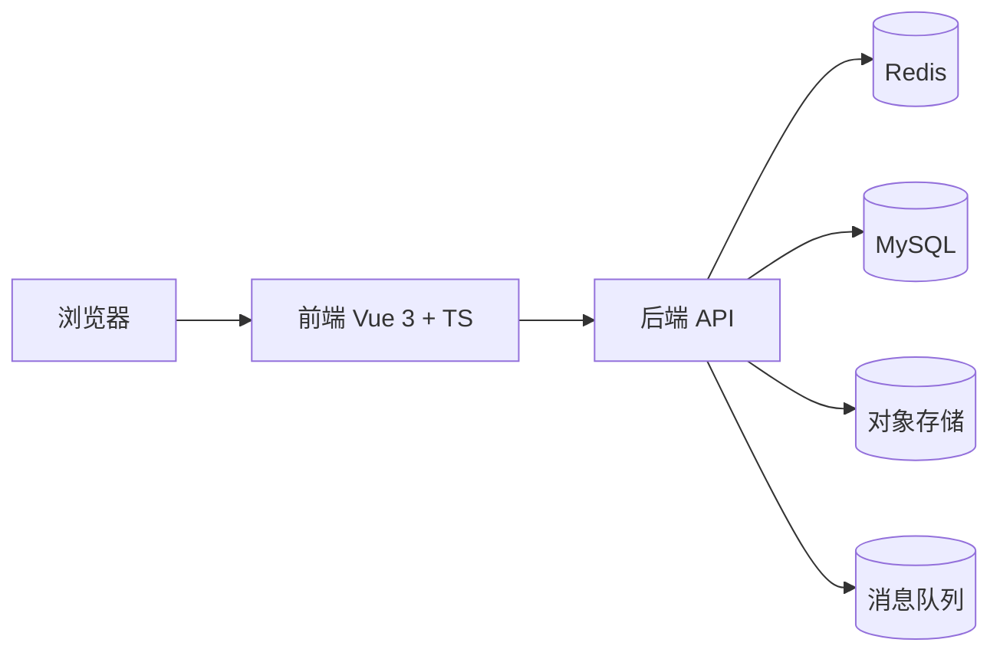

# 接力教育智慧云平台 - 系统架构与目录结构规范（V1.4）

## 1. 文档信息

- 架构版本：`v1.4`
- 对齐需求：`docs/exam-platform-requirements-spec-v1.3.md`
- UI 规范：`docs/design-system-v1.1.md`
- 技术栈：`docs/tech-stack.md`
- 更新时间：`2026-03-27 00:03:03`

本文件用于统一约束项目的系统分层、目录放置、页面与组件归档、左侧菜单命名、API 约定以及数据库结构。后续所有前端、后端、数据库相关开发，默认以本文件为准。

本版本重点补强三件事：

- 目录结构最多两级，但要清楚告诉 AI 页面、组件、路由、接口、状态、类型分别放哪里。
- 左侧菜单名称必须短，默认 4 字左右，单项最多不超过 5 个字。
- 按角色拆分菜单模块，避免所有角色共用一套模糊菜单。

## 2. 系统架构总览

### 2.1 分层说明

- 前端：`Vue 3 + TypeScript + Vite + Pinia + Vue Router 4`
- UI：`Ant Design Vue + Tailwind CSS`
- 后端：`Java 21 + Spring Boot 3.x + Spring Security + JWT + MyBatis-Plus`
- 数据：`MySQL 8.x + Redis 7.x`
- 文件：对象存储或本地文件服务
- 运维：`Docker + Nginx + CI/CD`

### 2.2 逻辑架构



### 2.3 模块分工

- 前端负责页面展示、交互、路由守卫、假数据演示、表单校验和可视化反馈。
- 后端负责鉴权、业务编排、数据持久化、日志审计、成绩计算、文件处理和接口统一返回。
- 数据库负责核心业务数据存储，所有关键操作必须可追溯。

## 3. 目录结构规范

### 3.1 项目 Tree

目录树最多保留两级，先让 AI 明确主目录边界，再通过下面的放置规则定位到更细粒度路径。

```text
examSystem/
├─ frontend/
├─ backend/
└─ docs/
```

### 3.2 前端放置规则

- 页面统一放在 `frontend/src/pages/<role>/<module>/index.vue`
- 组件统一放在 `frontend/src/components/<domain>/<name>.vue`
- 路由统一放在 `frontend/src/router/modules/<role>.ts`
- 状态统一放在 `frontend/src/stores/<domain>.ts`
- 假数据统一放在 `frontend/src/mock/<domain>.ts`
- 类型定义统一放在 `frontend/src/types/<domain>.ts`
- 接口封装统一放在 `frontend/src/api/<domain>.ts`
- 工具方法统一放在 `frontend/src/utils/`
- 布局统一放在 `frontend/src/layouts/`

### 3.3 前端页面建议

- 管理员页面：`frontend/src/pages/admin/`
- 教师页面：`frontend/src/pages/teacher/`
- 评卷页面：`frontend/src/pages/reviewer/`
- 学生页面：`frontend/src/pages/student/`

页面示例：

- `frontend/src/pages/admin/dashboard/index.vue`
- `frontend/src/pages/admin/account/index.vue`
- `frontend/src/pages/admin/activation/index.vue`
- `frontend/src/pages/admin/import/index.vue`
- `frontend/src/pages/admin/question-bank/index.vue`
- `frontend/src/pages/admin/session/index.vue`
- `frontend/src/pages/admin/resource/index.vue`
- `frontend/src/pages/admin/review/index.vue`
- `frontend/src/pages/admin/score/index.vue`
- `frontend/src/pages/admin/audit/index.vue`
- `frontend/src/pages/student/exam/index.vue`
- `frontend/src/pages/student/result/index.vue`
- `frontend/src/pages/teacher/resource/index.vue`
- `frontend/src/pages/reviewer/task/index.vue`

### 3.4 页面与组件落位示例

页面与组件必须按“页面归页面、组件归组件、路由归路由”的原则拆分，不允许把页面散落在组件目录里。

- 页面入口统一建在 `frontend/src/pages/<role>/<module>/index.vue`
- 业务组件统一建在 `frontend/src/components/<domain>/<component>.vue`
- 路由模块统一建在 `frontend/src/router/modules/<role>.ts`
- 状态模块统一建在 `frontend/src/stores/<domain>.ts`
- 接口模块统一建在 `frontend/src/api/<domain>.ts`
- 类型定义统一建在 `frontend/src/types/<domain>.ts`
- 假数据统一建在 `frontend/src/mock/<domain>.ts`
- 工具方法统一建在 `frontend/src/utils/`

典型落位示例：

- 管理看板页：`frontend/src/pages/admin/dashboard/index.vue`
- 题库卡片：`frontend/src/components/dashboard/MetricCard.vue`
- 考试答题卡：`frontend/src/components/exam/QuestionNavigator.vue`
- 主观题上传区：`frontend/src/components/upload/AnswerUploadPanel.vue`
- 评卷抽屉：`frontend/src/components/review/ScoreDrawer.vue`

### 3.5 前端组件建议

- `frontend/src/components/common/`：通用按钮、弹窗、表单、表格壳
- `frontend/src/components/dashboard/`：看板卡片、指标卡、口径提示
- `frontend/src/components/exam/`：答题卡、倒计时、自动保存、提交确认
- `frontend/src/components/upload/`：附件上传、预览、重传
- `frontend/src/components/review/`：打分面板、复核面板、评分说明

组件示例：

- `frontend/src/components/dashboard/MetricCard.vue`
- `frontend/src/components/dashboard/DefinitionTip.vue`
- `frontend/src/components/exam/QuestionNavigator.vue`
- `frontend/src/components/exam/CountdownBar.vue`
- `frontend/src/components/upload/AnswerUploadPanel.vue`
- `frontend/src/components/review/ScoreDrawer.vue`

### 3.6 后端放置规则

- 公共能力放在 `backend/src/main/java/com/exam/common/`
- 通用配置放在 `backend/src/main/java/com/exam/config/`
- 登录鉴权放在 `backend/src/main/java/com/exam/auth/`
- 领域模块放在 `backend/src/main/java/com/exam/modules/<domain>/`
- 数据迁移脚本放在 `backend/src/main/resources/db/migration/`
- Mapper 文件放在 `backend/src/main/resources/mapper/`

领域模块建议拆分如下：

- `account`：账号、策略、周期
- `activation`：激活码、激活记录
- `enrollment`：报名、导入、补全
- `questionbank`：题库、题目、组卷
- `exam`：场次、试卷、作答、提交
- `review`：评卷、复核、成绩聚合
- `resource`：资源中心
- `dashboard`：总览看板
- `audit`：日志、反馈、追溯

后端模块内部建议保持统一分层：

- `controller`：接口入口
- `service`：业务编排
- `service/impl`：业务实现
- `mapper`：数据库访问
- `entity`：表实体
- `dto`：请求对象
- `vo`：响应对象
- `convert`：对象转换

## 4. 左侧菜单命名

一级菜单和二级菜单都必须简洁，单项最多不超过 5 个字。推荐命名如下：

| 一级菜单 | 二级菜单 | 说明 |
| --- | --- | --- |
| 总览 | 看板 | 首页指标与待办 |
| 账号 | 管理 / 策略 | 练习号、考试号、价格、周期 |
| 激活 | 生成 / 记录 | 激活码、激活留痕 |
| 导入 | 名单 / 补全 | 报名导入、教师关联 |
| 题库 | 目录 / 组卷 / 题目 | 题库、试题、组卷 |
| 场次 | 配置 / 监控 / 白名单 | 场次、时间、准入控制 |
| 资源 | 中心 / 分类 | 资源文件、目录管理 |
| 评卷 | 任务 / 复核 | 主观题评卷、复核 |
| 成绩 | 查询 / 导出 / 发布 | 成绩查看、导出、发布 |
| 留存 | 日志 / 反馈 | 操作日志、反馈工单 |

命名原则：

- 一级菜单优先使用业务抽象词，不使用长句。
- 二级菜单优先使用动作词或对象词。
- 路由中文展示名保持短、准、稳。
- 与需求文档中的角色命名保持一致，避免同义词混用。

### 4.1 角色菜单模块

平台管理员、教师、评卷老师、学生使用的菜单不应完全相同。下面给出推荐拆分，实际开发时可在此基础上按权限做收敛。

| 角色 | 一级菜单 | 二级菜单 |
| --- | --- | --- |
| 平台管理员 | 总览、账号、激活、导入、题库、场次、资源、评卷、成绩、留存 | 看板、管理、策略、生成、记录、名单、补全、目录、组卷、题目、配置、监控、白名单、中心、分类、任务、复核、查询、导出、发布、日志、反馈 |
| 教师 | 总览、资源、题库、学情、通知 | 看板、中心、目录、组卷、题目、统计、分析、消息 |
| 评卷老师 | 总览、评卷、复核、留痕 | 待评、已评、抽检、申诉、记录 |
| 学生（练习） | 总览、练习、错题、资源、结果 | 刷题、本卷、错题、收藏、中心、记录 |
| 学生（考试） | 总览、考试、答题、成绩 | 场次、答卷、提交、查询、发布 |

角色落位建议：

- 平台管理员页面放在 `frontend/src/pages/admin/`
- 教师页面放在 `frontend/src/pages/teacher/`
- 评卷老师页面放在 `frontend/src/pages/reviewer/`
- 学生练习页放在 `frontend/src/pages/student/practice/`
- 学生考试页放在 `frontend/src/pages/student/exam/`

## 5. API 约定

### 5.1 请求头

- `Content-Type: application/json`
- `Authorization: Bearer <token>`
- `X-Request-Id: <trace-id>`，用于串联日志
- 文件上传接口使用 `multipart/form-data`

### 5.2 统一返回格式

```json
{
  "code": 200,
  "data": {},
  "msg": "ok",
  "traceId": "trace-20260326-001",
  "timestamp": 1743000000000
}
```

### 5.3 状态码约定

- `200`：成功
- `400`：参数校验失败
- `401`：未登录或 token 失效
- `403`：无权限
- `404`：资源不存在
- `500`：系统异常

### 5.4 鉴权方式

- 统一使用 `JWT`。
- 登录后返回 `accessToken`，前端放入请求头。
- 接口权限按 `RBAC` 控制，菜单权限和按钮权限分开处理。
- 涉及提交、自动保存、打分、发布等接口，必须保留幂等和审计能力。

### 5.5 分页格式

```json
{
  "code": 200,
  "data": {
    "list": [],
    "total": 0,
    "page": 1,
    "pageSize": 20
  },
  "msg": "ok"
}
```

## 6. 数据库结构

### 6.1 设计原则

- 统一使用 `MySQL 8.x`，字符集使用 `utf8mb4`。
- 所有核心业务表保留 `created_at`、`updated_at`、`created_by` 等追踪字段。
- 重要流程必须可审计，关键操作写入 `operation_log`。
- 主观题、附件、评分、成绩发布等流程要能按 `paper_id`、`session_id` 追踪。
- 统一使用主键自增或雪花主键，本文档以自增主键示例说明。

### 6.2 核心关系

- `sys_user` 与 `sys_role` 通过 `sys_user_role` 多对多关联。
- `practice_account_policy` 与 `practice_account_status` 一对多关联。
- `activation_code` 与 `activation_record` 一对多关联。
- `question_bank` 与 `question` 一对多关联。
- `question` 与 `question_option` 一对多关联。
- `exam_session` 与 `exam_candidate` 一对多关联。
- `exam_session` 与 `exam_paper` 一对多关联。
- `exam_paper` 与 `exam_answer` 一对多关联。
- `exam_answer` 与 `answer_upload` 一对多关联。
- `exam_paper` 与 `review_score` 一对多关联。
- `exam_paper` 与 `exam_score` 一对一关联。
- `score_policy` 决定主观题合分规则。

### 6.3 MySQL DDL

```sql
CREATE TABLE `sys_role` (
  `id` BIGINT PRIMARY KEY AUTO_INCREMENT COMMENT '主键',
  `role_code` VARCHAR(40) NOT NULL UNIQUE COMMENT '角色编码',
  `role_name` VARCHAR(80) NOT NULL COMMENT '角色名称',
  `created_at` DATETIME NOT NULL DEFAULT CURRENT_TIMESTAMP COMMENT '创建时间'
) ENGINE=InnoDB DEFAULT CHARSET=utf8mb4 COMMENT='系统角色表';

CREATE TABLE `sys_user` (
  `id` BIGINT PRIMARY KEY AUTO_INCREMENT COMMENT '主键',
  `username` VARCHAR(80) NOT NULL UNIQUE COMMENT '登录账号',
  `password_hash` VARCHAR(255) NOT NULL COMMENT '密码摘要',
  `real_name` VARCHAR(80) NOT NULL COMMENT '真实姓名',
  `id_card_no` VARCHAR(32) COMMENT '身份证号',
  `mobile` VARCHAR(20) COMMENT '手机号',
  `account_type` ENUM('PRACTICE', 'EXAM', 'STAFF') NOT NULL DEFAULT 'STAFF' COMMENT '账号类型',
  `stage` ENUM('PRIMARY', 'MIDDLE') DEFAULT NULL COMMENT '适用学段',
  `status` ENUM('ENABLED', 'DISABLED', 'LOCKED') NOT NULL DEFAULT 'ENABLED' COMMENT '账号状态',
  `last_login_at` DATETIME COMMENT '最近登录时间',
  `created_at` DATETIME NOT NULL DEFAULT CURRENT_TIMESTAMP COMMENT '创建时间',
  `updated_at` DATETIME NOT NULL DEFAULT CURRENT_TIMESTAMP ON UPDATE CURRENT_TIMESTAMP COMMENT '更新时间'
) ENGINE=InnoDB DEFAULT CHARSET=utf8mb4 COMMENT='系统用户表';

CREATE TABLE `sys_user_role` (
  `user_id` BIGINT NOT NULL COMMENT '用户ID',
  `role_id` BIGINT NOT NULL COMMENT '角色ID',
  PRIMARY KEY (`user_id`, `role_id`),
  CONSTRAINT `fk_sys_user_role_user` FOREIGN KEY (`user_id`) REFERENCES `sys_user`(`id`) ON DELETE CASCADE,
  CONSTRAINT `fk_sys_user_role_role` FOREIGN KEY (`role_id`) REFERENCES `sys_role`(`id`) ON DELETE CASCADE
) ENGINE=InnoDB DEFAULT CHARSET=utf8mb4 COMMENT='用户角色关联表';

CREATE TABLE `practice_account_policy` (
  `id` BIGINT PRIMARY KEY AUTO_INCREMENT COMMENT '主键',
  `policy_name` VARCHAR(120) NOT NULL COMMENT '策略名称',
  `price` DECIMAL(10,2) NOT NULL DEFAULT 0 COMMENT '价格',
  `duration_days` INT NOT NULL COMMENT '有效天数',
  `valid_from` DATETIME COMMENT '生效时间',
  `valid_to` DATETIME COMMENT '失效时间',
  `status` ENUM('ACTIVE', 'INACTIVE') NOT NULL DEFAULT 'ACTIVE' COMMENT '策略状态',
  `created_by` BIGINT NOT NULL COMMENT '创建人',
  `created_at` DATETIME NOT NULL DEFAULT CURRENT_TIMESTAMP COMMENT '创建时间',
  CONSTRAINT `fk_practice_policy_created_by` FOREIGN KEY (`created_by`) REFERENCES `sys_user`(`id`)
) ENGINE=InnoDB DEFAULT CHARSET=utf8mb4 COMMENT='练习账号策略表';

CREATE TABLE `practice_account_status` (
  `id` BIGINT PRIMARY KEY AUTO_INCREMENT COMMENT '主键',
  `user_id` BIGINT NOT NULL COMMENT '用户ID',
  `policy_id` BIGINT NOT NULL COMMENT '策略ID',
  `effective_from` DATETIME NOT NULL COMMENT '生效开始',
  `effective_to` DATETIME NOT NULL COMMENT '生效结束',
  `status` ENUM('NOT_EFFECTIVE', 'EFFECTIVE', 'EXPIRED') NOT NULL COMMENT '状态',
  `updated_at` DATETIME NOT NULL DEFAULT CURRENT_TIMESTAMP ON UPDATE CURRENT_TIMESTAMP COMMENT '更新时间',
  UNIQUE KEY `uk_practice_user_policy` (`user_id`, `policy_id`),
  CONSTRAINT `fk_practice_status_user` FOREIGN KEY (`user_id`) REFERENCES `sys_user`(`id`),
  CONSTRAINT `fk_practice_status_policy` FOREIGN KEY (`policy_id`) REFERENCES `practice_account_policy`(`id`)
) ENGINE=InnoDB DEFAULT CHARSET=utf8mb4 COMMENT='练习账号状态表';

CREATE TABLE `activation_code` (
  `id` BIGINT PRIMARY KEY AUTO_INCREMENT COMMENT '主键',
  `code` VARCHAR(64) NOT NULL UNIQUE COMMENT '激活码',
  `stage` ENUM('PRIMARY', 'MIDDLE') NOT NULL COMMENT '适用学段',
  `target_role` ENUM('TEACHER', 'STUDENT') NOT NULL COMMENT '目标角色',
  `resource_scope` ENUM('QUESTION_BANK', 'QUESTION_BANK_AND_TRAINING') NOT NULL COMMENT '资源范围',
  `valid_from` DATETIME NOT NULL COMMENT '生效时间',
  `valid_to` DATETIME NOT NULL COMMENT '失效时间',
  `status` ENUM('NOT_EFFECTIVE', 'ACTIVE', 'EXPIRED', 'FROZEN', 'USED') NOT NULL DEFAULT 'NOT_EFFECTIVE' COMMENT '状态',
  `created_by` BIGINT NOT NULL COMMENT '创建人',
  `created_at` DATETIME NOT NULL DEFAULT CURRENT_TIMESTAMP COMMENT '创建时间',
  CONSTRAINT `fk_activation_code_creator` FOREIGN KEY (`created_by`) REFERENCES `sys_user`(`id`)
) ENGINE=InnoDB DEFAULT CHARSET=utf8mb4 COMMENT='激活码表';

CREATE TABLE `activation_record` (
  `id` BIGINT PRIMARY KEY AUTO_INCREMENT COMMENT '主键',
  `activation_code_id` BIGINT NOT NULL COMMENT '激活码ID',
  `activated_user_id` BIGINT NOT NULL COMMENT '被激活用户ID',
  `device_id` VARCHAR(120) COMMENT '设备标识',
  `source_channel` VARCHAR(60) COMMENT '来源渠道',
  `activated_at` DATETIME NOT NULL DEFAULT CURRENT_TIMESTAMP COMMENT '激活时间',
  CONSTRAINT `fk_activation_record_code` FOREIGN KEY (`activation_code_id`) REFERENCES `activation_code`(`id`),
  CONSTRAINT `fk_activation_record_user` FOREIGN KEY (`activated_user_id`) REFERENCES `sys_user`(`id`)
) ENGINE=InnoDB DEFAULT CHARSET=utf8mb4 COMMENT='激活留痕表';

CREATE TABLE `enrollment` (
  `id` BIGINT PRIMARY KEY AUTO_INCREMENT COMMENT '主键',
  `area` VARCHAR(80) NOT NULL COMMENT '地区',
  `project_code` VARCHAR(60) NOT NULL COMMENT '项目编码',
  `project_name` VARCHAR(120) NOT NULL COMMENT '项目名称',
  `group_name` VARCHAR(80) NOT NULL COMMENT '分组名称',
  `student_name` VARCHAR(80) NOT NULL COMMENT '学生姓名',
  `student_id_card` VARCHAR(32) NOT NULL COMMENT '身份证号',
  `school_name` VARCHAR(160) NOT NULL COMMENT '学校名称',
  `teacher_name` VARCHAR(80) COMMENT '教师姓名',
  `teacher_org` VARCHAR(160) COMMENT '教师单位',
  `contact_mobile` VARCHAR(20) COMMENT '联系电话',
  `import_batch_no` VARCHAR(64) NOT NULL COMMENT '导入批次号',
  `created_at` DATETIME NOT NULL DEFAULT CURRENT_TIMESTAMP COMMENT '创建时间',
  UNIQUE KEY `uk_enrollment_student` (`project_code`, `student_id_card`)
) ENGINE=InnoDB DEFAULT CHARSET=utf8mb4 COMMENT='报名导入表';

CREATE TABLE `question_bank` (
  `id` BIGINT PRIMARY KEY AUTO_INCREMENT COMMENT '主键',
  `bank_name` VARCHAR(160) NOT NULL COMMENT '题库名称',
  `stage` ENUM('PRIMARY', 'MIDDLE') NOT NULL COMMENT '适用学段',
  `suite_no` INT NOT NULL COMMENT '套卷编号',
  `status` ENUM('DRAFT', 'PUBLISHED') NOT NULL DEFAULT 'DRAFT' COMMENT '状态',
  `created_by` BIGINT NOT NULL COMMENT '创建人',
  `created_at` DATETIME NOT NULL DEFAULT CURRENT_TIMESTAMP COMMENT '创建时间',
  CONSTRAINT `fk_question_bank_creator` FOREIGN KEY (`created_by`) REFERENCES `sys_user`(`id`)
) ENGINE=InnoDB DEFAULT CHARSET=utf8mb4 COMMENT='题库表';

CREATE TABLE `question` (
  `id` BIGINT PRIMARY KEY AUTO_INCREMENT COMMENT '主键',
  `bank_id` BIGINT NOT NULL COMMENT '题库ID',
  `question_type` ENUM('SINGLE', 'MULTI', 'JUDGE', 'SUBJECTIVE') NOT NULL COMMENT '题型',
  `content` TEXT NOT NULL COMMENT '题干',
  `score` DECIMAL(6,2) NOT NULL COMMENT '分值',
  `difficulty` TINYINT NOT NULL DEFAULT 3 COMMENT '难度等级',
  `tags` VARCHAR(255) COMMENT '标签',
  `answer_rule` JSON COMMENT '判题规则',
  `created_at` DATETIME NOT NULL DEFAULT CURRENT_TIMESTAMP COMMENT '创建时间',
  CONSTRAINT `fk_question_bank` FOREIGN KEY (`bank_id`) REFERENCES `question_bank`(`id`)
) ENGINE=InnoDB DEFAULT CHARSET=utf8mb4 COMMENT='题目表';

CREATE TABLE `question_option` (
  `id` BIGINT PRIMARY KEY AUTO_INCREMENT COMMENT '主键',
  `question_id` BIGINT NOT NULL COMMENT '题目ID',
  `option_key` CHAR(1) NOT NULL COMMENT '选项键',
  `option_text` VARCHAR(500) NOT NULL COMMENT '选项内容',
  `is_correct` TINYINT NOT NULL DEFAULT 0 COMMENT '是否正确',
  CONSTRAINT `fk_question_option_question` FOREIGN KEY (`question_id`) REFERENCES `question`(`id`)
) ENGINE=InnoDB DEFAULT CHARSET=utf8mb4 COMMENT='题目选项表';

CREATE TABLE `exam_session` (
  `id` BIGINT PRIMARY KEY AUTO_INCREMENT COMMENT '主键',
  `session_name` VARCHAR(160) NOT NULL COMMENT '场次名称',
  `stage` ENUM('PRIMARY', 'MIDDLE') NOT NULL COMMENT '适用学段',
  `bank_id` BIGINT NOT NULL COMMENT '题库ID',
  `start_time` DATETIME NOT NULL COMMENT '开始时间',
  `end_time` DATETIME NOT NULL COMMENT '结束时间',
  `duration_minutes` INT NOT NULL COMMENT '时长',
  `global_extra_minutes` INT NOT NULL DEFAULT 0 COMMENT '全局加时',
  `open_status` ENUM('READY', 'OPEN', 'CLOSED', 'FINISHED') NOT NULL DEFAULT 'READY' COMMENT '开放状态',
  `score_publish_switch` TINYINT NOT NULL DEFAULT 0 COMMENT '成绩发布开关',
  `review_deadline` DATETIME COMMENT '阅卷截止时间',
  `created_by` BIGINT NOT NULL COMMENT '创建人',
  `created_at` DATETIME NOT NULL DEFAULT CURRENT_TIMESTAMP COMMENT '创建时间',
  CONSTRAINT `fk_exam_session_bank` FOREIGN KEY (`bank_id`) REFERENCES `question_bank`(`id`),
  CONSTRAINT `fk_exam_session_creator` FOREIGN KEY (`created_by`) REFERENCES `sys_user`(`id`)
) ENGINE=InnoDB DEFAULT CHARSET=utf8mb4 COMMENT='考试场次表';

CREATE TABLE `exam_candidate` (
  `id` BIGINT PRIMARY KEY AUTO_INCREMENT COMMENT '主键',
  `session_id` BIGINT NOT NULL COMMENT '场次ID',
  `user_id` BIGINT NOT NULL COMMENT '考生ID',
  `extra_minutes` INT NOT NULL DEFAULT 0 COMMENT '个人加时',
  `admit_status` ENUM('PENDING', 'APPROVED', 'BLOCKED') NOT NULL DEFAULT 'APPROVED' COMMENT '准入状态',
  `created_at` DATETIME NOT NULL DEFAULT CURRENT_TIMESTAMP COMMENT '创建时间',
  UNIQUE KEY `uk_exam_candidate` (`session_id`, `user_id`),
  CONSTRAINT `fk_exam_candidate_session` FOREIGN KEY (`session_id`) REFERENCES `exam_session`(`id`),
  CONSTRAINT `fk_exam_candidate_user` FOREIGN KEY (`user_id`) REFERENCES `sys_user`(`id`)
) ENGINE=InnoDB DEFAULT CHARSET=utf8mb4 COMMENT='考试考生表';

CREATE TABLE `exam_paper` (
  `id` BIGINT PRIMARY KEY AUTO_INCREMENT COMMENT '主键',
  `session_id` BIGINT NOT NULL COMMENT '场次ID',
  `student_user_id` BIGINT NOT NULL COMMENT '考生用户ID',
  `submit_time` DATETIME COMMENT '交卷时间',
  `objective_total_score` DECIMAL(8,2) NOT NULL DEFAULT 0 COMMENT '客观题总分',
  `subjective_total_score` DECIMAL(8,2) NOT NULL DEFAULT 0 COMMENT '主观题总分',
  `total_score` DECIMAL(8,2) NOT NULL DEFAULT 0 COMMENT '总分',
  `review_status` ENUM('NOT_REVIEWED', 'REVIEWING', 'REVIEWED') NOT NULL DEFAULT 'NOT_REVIEWED' COMMENT '阅卷状态',
  `status` ENUM('IN_PROGRESS', 'SUBMITTED', 'LOCKED') NOT NULL DEFAULT 'IN_PROGRESS' COMMENT '试卷状态',
  `created_at` DATETIME NOT NULL DEFAULT CURRENT_TIMESTAMP COMMENT '创建时间',
  UNIQUE KEY `uk_session_student` (`session_id`, `student_user_id`),
  CONSTRAINT `fk_exam_paper_session` FOREIGN KEY (`session_id`) REFERENCES `exam_session`(`id`),
  CONSTRAINT `fk_exam_paper_student` FOREIGN KEY (`student_user_id`) REFERENCES `sys_user`(`id`)
) ENGINE=InnoDB DEFAULT CHARSET=utf8mb4 COMMENT='考试试卷表';

CREATE TABLE `exam_answer` (
  `id` BIGINT PRIMARY KEY AUTO_INCREMENT COMMENT '主键',
  `paper_id` BIGINT NOT NULL COMMENT '试卷ID',
  `question_id` BIGINT NOT NULL COMMENT '题目ID',
  `answer_text` TEXT COMMENT '文本答案',
  `answer_json` JSON COMMENT '结构化答案',
  `autosaved_at` DATETIME COMMENT '最近自动保存时间',
  `final_saved_at` DATETIME COMMENT '最终保存时间',
  `objective_score` DECIMAL(6,2) NOT NULL DEFAULT 0 COMMENT '客观题得分',
  `subjective_score` DECIMAL(6,2) NOT NULL DEFAULT 0 COMMENT '主观题得分',
  `final_score` DECIMAL(6,2) NOT NULL DEFAULT 0 COMMENT '单题最终得分',
  `created_at` DATETIME NOT NULL DEFAULT CURRENT_TIMESTAMP COMMENT '创建时间',
  UNIQUE KEY `uk_paper_question` (`paper_id`, `question_id`),
  CONSTRAINT `fk_exam_answer_paper` FOREIGN KEY (`paper_id`) REFERENCES `exam_paper`(`id`),
  CONSTRAINT `fk_exam_answer_question` FOREIGN KEY (`question_id`) REFERENCES `question`(`id`)
) ENGINE=InnoDB DEFAULT CHARSET=utf8mb4 COMMENT='考试作答表';

CREATE TABLE `answer_upload` (
  `id` BIGINT PRIMARY KEY AUTO_INCREMENT COMMENT '主键',
  `answer_id` BIGINT NOT NULL COMMENT '答案ID',
  `file_name` VARCHAR(255) NOT NULL COMMENT '文件名',
  `file_type` VARCHAR(40) NOT NULL COMMENT '文件类型',
  `file_url` VARCHAR(500) NOT NULL COMMENT '文件地址',
  `file_size` BIGINT NOT NULL COMMENT '文件大小',
  `upload_status` ENUM('UPLOADED', 'REPLACED') NOT NULL DEFAULT 'UPLOADED' COMMENT '上传状态',
  `uploaded_at` DATETIME NOT NULL DEFAULT CURRENT_TIMESTAMP COMMENT '上传时间',
  CONSTRAINT `fk_answer_upload_answer` FOREIGN KEY (`answer_id`) REFERENCES `exam_answer`(`id`)
) ENGINE=InnoDB DEFAULT CHARSET=utf8mb4 COMMENT='作答附件表';

CREATE TABLE `score_policy` (
  `id` BIGINT PRIMARY KEY AUTO_INCREMENT COMMENT '主键',
  `stage` ENUM('PRIMARY', 'MIDDLE') NOT NULL COMMENT '适用学段',
  `reviewer_count` INT NOT NULL DEFAULT 3 COMMENT '评卷人数',
  `aggregate_algo` ENUM('AVG', 'MEDIAN') NOT NULL DEFAULT 'AVG' COMMENT '聚合算法',
  `status` ENUM('ACTIVE', 'INACTIVE') NOT NULL DEFAULT 'ACTIVE' COMMENT '状态',
  `created_by` BIGINT NOT NULL COMMENT '创建人',
  `created_at` DATETIME NOT NULL DEFAULT CURRENT_TIMESTAMP COMMENT '创建时间',
  CONSTRAINT `fk_score_policy_creator` FOREIGN KEY (`created_by`) REFERENCES `sys_user`(`id`)
) ENGINE=InnoDB DEFAULT CHARSET=utf8mb4 COMMENT='评分策略表';

CREATE TABLE `review_score` (
  `id` BIGINT PRIMARY KEY AUTO_INCREMENT COMMENT '主键',
  `paper_id` BIGINT NOT NULL COMMENT '试卷ID',
  `question_id` BIGINT NOT NULL COMMENT '题目ID',
  `reviewer_id` BIGINT NOT NULL COMMENT '评卷人ID',
  `score` DECIMAL(6,2) NOT NULL COMMENT '评分',
  `comment_text` VARCHAR(1000) COMMENT '评语',
  `reviewed_at` DATETIME NOT NULL DEFAULT CURRENT_TIMESTAMP COMMENT '评卷时间',
  UNIQUE KEY `uk_paper_question_reviewer` (`paper_id`, `question_id`, `reviewer_id`),
  CONSTRAINT `fk_review_score_paper` FOREIGN KEY (`paper_id`) REFERENCES `exam_paper`(`id`),
  CONSTRAINT `fk_review_score_question` FOREIGN KEY (`question_id`) REFERENCES `question`(`id`),
  CONSTRAINT `fk_review_score_reviewer` FOREIGN KEY (`reviewer_id`) REFERENCES `sys_user`(`id`)
) ENGINE=InnoDB DEFAULT CHARSET=utf8mb4 COMMENT='评卷明细表';

CREATE TABLE `exam_score` (
  `id` BIGINT PRIMARY KEY AUTO_INCREMENT COMMENT '主键',
  `paper_id` BIGINT NOT NULL UNIQUE COMMENT '试卷ID',
  `score_policy_id` BIGINT NOT NULL COMMENT '评分策略ID',
  `objective_total` DECIMAL(8,2) NOT NULL DEFAULT 0 COMMENT '客观题总分',
  `subjective_total` DECIMAL(8,2) NOT NULL DEFAULT 0 COMMENT '主观题总分',
  `total_score` DECIMAL(8,2) NOT NULL DEFAULT 0 COMMENT '总分',
  `rank_no` INT COMMENT '名次',
  `score_sync_status` ENUM('PENDING', 'SYNCED', 'FAILED') NOT NULL DEFAULT 'PENDING' COMMENT '同步状态',
  `score_synced_at` DATETIME COMMENT '同步时间',
  `calculated_at` DATETIME NOT NULL DEFAULT CURRENT_TIMESTAMP COMMENT '计算时间',
  CONSTRAINT `fk_exam_score_paper` FOREIGN KEY (`paper_id`) REFERENCES `exam_paper`(`id`),
  CONSTRAINT `fk_exam_score_policy` FOREIGN KEY (`score_policy_id`) REFERENCES `score_policy`(`id`)
) ENGINE=InnoDB DEFAULT CHARSET=utf8mb4 COMMENT='考试成绩表';

CREATE TABLE `resource_file` (
  `id` BIGINT PRIMARY KEY AUTO_INCREMENT COMMENT '主键',
  `stage` ENUM('PRIMARY', 'MIDDLE') NOT NULL COMMENT '适用学段',
  `category_path` VARCHAR(255) NOT NULL COMMENT '目录路径',
  `file_name` VARCHAR(255) NOT NULL COMMENT '文件名',
  `file_type` VARCHAR(40) NOT NULL COMMENT '文件类型',
  `file_url` VARCHAR(500) NOT NULL COMMENT '文件地址',
  `preview_only` TINYINT NOT NULL DEFAULT 1 COMMENT '仅预览',
  `upload_user_id` BIGINT NOT NULL COMMENT '上传人',
  `created_at` DATETIME NOT NULL DEFAULT CURRENT_TIMESTAMP COMMENT '创建时间',
  CONSTRAINT `fk_resource_file_user` FOREIGN KEY (`upload_user_id`) REFERENCES `sys_user`(`id`)
) ENGINE=InnoDB DEFAULT CHARSET=utf8mb4 COMMENT='资源文件表';

CREATE TABLE `system_setting` (
  `id` BIGINT PRIMARY KEY AUTO_INCREMENT COMMENT '主键',
  `setting_key` VARCHAR(120) NOT NULL UNIQUE COMMENT '配置键',
  `setting_value` JSON NOT NULL COMMENT '配置值',
  `setting_desc` VARCHAR(255) COMMENT '配置说明',
  `status` ENUM('ACTIVE', 'INACTIVE') NOT NULL DEFAULT 'ACTIVE' COMMENT '状态',
  `updated_by` BIGINT COMMENT '更新人',
  `updated_at` DATETIME NOT NULL DEFAULT CURRENT_TIMESTAMP ON UPDATE CURRENT_TIMESTAMP COMMENT '更新时间',
  CONSTRAINT `fk_system_setting_user` FOREIGN KEY (`updated_by`) REFERENCES `sys_user`(`id`)
) ENGINE=InnoDB DEFAULT CHARSET=utf8mb4 COMMENT='系统配置表';

CREATE TABLE `feedback_ticket` (
  `id` BIGINT PRIMARY KEY AUTO_INCREMENT COMMENT '主键',
  `title` VARCHAR(160) NOT NULL COMMENT '反馈标题',
  `content` TEXT NOT NULL COMMENT '反馈内容',
  `status` ENUM('OPEN', 'IN_PROGRESS', 'DONE') NOT NULL DEFAULT 'OPEN' COMMENT '处理状态',
  `created_by` BIGINT NOT NULL COMMENT '创建人',
  `handled_by` BIGINT COMMENT '处理人',
  `created_at` DATETIME NOT NULL DEFAULT CURRENT_TIMESTAMP COMMENT '创建时间',
  `handled_at` DATETIME COMMENT '处理时间',
  CONSTRAINT `fk_feedback_ticket_creator` FOREIGN KEY (`created_by`) REFERENCES `sys_user`(`id`),
  CONSTRAINT `fk_feedback_ticket_handler` FOREIGN KEY (`handled_by`) REFERENCES `sys_user`(`id`)
) ENGINE=InnoDB DEFAULT CHARSET=utf8mb4 COMMENT='反馈工单表';

CREATE TABLE `operation_log` (
  `id` BIGINT PRIMARY KEY AUTO_INCREMENT COMMENT '主键',
  `trace_id` VARCHAR(64) NOT NULL COMMENT '链路ID',
  `operator_user_id` BIGINT NOT NULL COMMENT '操作人',
  `module_name` VARCHAR(80) NOT NULL COMMENT '模块名',
  `action_name` VARCHAR(120) NOT NULL COMMENT '动作名',
  `target_type` VARCHAR(80) COMMENT '目标类型',
  `target_id` VARCHAR(80) COMMENT '目标ID',
  `action_reason` VARCHAR(500) COMMENT '操作原因',
  `action_result` ENUM('SUCCESS', 'FAILED') NOT NULL DEFAULT 'SUCCESS' COMMENT '执行结果',
  `ip` VARCHAR(64) COMMENT '来源IP',
  `created_at` DATETIME NOT NULL DEFAULT CURRENT_TIMESTAMP COMMENT '创建时间',
  KEY `idx_operation_created_at` (`created_at`),
  KEY `idx_operation_trace_id` (`trace_id`),
  CONSTRAINT `fk_operation_log_user` FOREIGN KEY (`operator_user_id`) REFERENCES `sys_user`(`id`)
) ENGINE=InnoDB DEFAULT CHARSET=utf8mb4 COMMENT='操作日志表';
```

### 6.4 结果与规则

- 学生与家长结果页仅在 `review_status = REVIEWED` 且 `score_publish_switch = 1` 时可见。
- 主观题最终分由 `score_policy` 决定，可按平均分或中位数聚合。
- 场次开放、延时、成绩发布、资源上传、激活码生成等关键动作都必须写入 `operation_log`。
- 所有导入、批量生成、自动保存、提交、发布接口都应支持幂等控制。

## 7. 开发执行口径

- 新页面优先放入对应角色目录，再补齐组件和 mock。
- 先做布局、路由和假数据，再接真实后端。
- 前端实现必须遵循 `docs/design-system-v1.1.md`。
- 编程实现必须遵循 `docs/tech-stack.md`。
- 若需求、架构、UI、技术栈发生变化，必须先更新对应版本文档，再继续开发。
